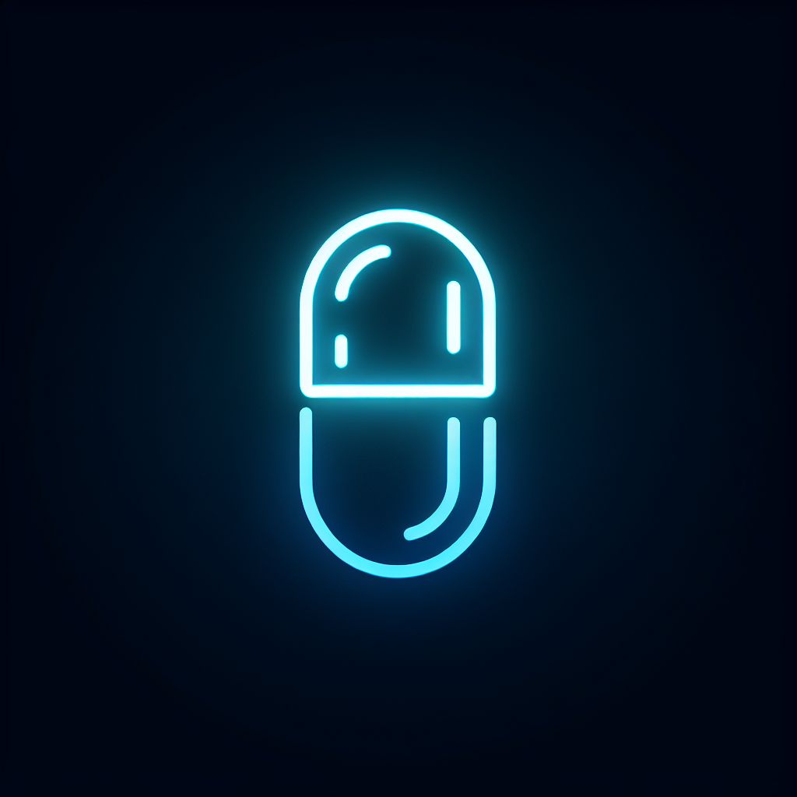

# Autonomous Capsule Characters Game

A 3D game featuring autonomous capsule characters with AI-driven personalities that learn through reinforcement learning.



## Features

- **AI-Driven Personalities**: Each character has a unique personality (energetic, shy, social, lazy) that influences how they move and interact.
- **Reinforcement Learning**: Characters learn from their experiences, adapting their behavior based on positive and negative reinforcement.
- **Dynamic Interactions**: Characters interact with their environment and each other in different ways based on their personality.
- **Interactive 3D Environment**: A visually appealing 3D environment with various obstacles and elements for characters to interact with.

## Getting Started

### Prerequisites

- [Node.js](https://nodejs.org/) (version 18 or higher)
- npm or yarn package manager

### Installation

1. Clone the repository:
   ```bash
   git clone https://github.com/yourusername/capsule-characters-game.git
   cd capsule-characters-game
   ```

2. Install dependencies:
   ```bash
   npm install
   # or
   yarn install
   ```

3. Start the development server:
   ```bash
   npm run dev
   # or
   yarn dev
   ```

4. Open your browser and navigate to `http://localhost:5000`

## How to Play

1. Click on a character to activate its AI behavior.
2. Observe how different personalities behave distinctly:
   - **Energetic** (Red): Moves quickly and covers large areas
   - **Shy** (Blue): Avoids other characters and moves cautiously
   - **Social** (Green): Seeks out other characters and enjoys company
   - **Lazy** (Yellow): Moves slowly and takes frequent breaks
3. Use orbit controls to navigate around the scene (mouse drag to rotate, scroll to zoom).
4. Characters learn through interaction and will adapt their behavior over time.

## Packaging for Different Platforms

### Building for Web

To build the web version of the game:

```bash
npm run build
# or
yarn build
```

The built files will be in the `dist` directory, which can be deployed to any web hosting service.

### Packaging as a Windows App

To package the game as a Windows application, we use Electron:

1. Install additional dependencies:
   ```bash
   npm install electron electron-builder --save-dev
   ```

2. Add the following scripts to package.json:
   ```json
   "scripts": {
     "electron": "electron .",
     "package-win": "electron-builder --win"
   }
   ```

3. Create `electron.js` in the root directory:
   ```javascript
   const { app, BrowserWindow } = require('electron');
   const path = require('path');
   const url = require('url');

   let mainWindow;

   function createWindow() {
     mainWindow = new BrowserWindow({
       width: 1280,
       height: 720,
       webPreferences: {
         nodeIntegration: true
       }
     });

     mainWindow.loadURL(
       url.format({
         pathname: path.join(__dirname, 'dist/index.html'),
         protocol: 'file:',
         slashes: true
       })
     );

     mainWindow.on('closed', function() {
       mainWindow = null;
     });
   }

   app.on('ready', createWindow);

   app.on('window-all-closed', function() {
     if (process.platform !== 'darwin') {
       app.quit();
     }
   });

   app.on('activate', function() {
     if (mainWindow === null) {
       createWindow();
     }
   });
   ```

4. Build the web version first, then package for Windows:
   ```bash
   npm run build
   npm run package-win
   ```

### Packaging as an Android App

To package the game as an Android application, we use Capacitor:

1. Install Capacitor and dependencies:
   ```bash
   npm install @capacitor/core @capacitor/android
   npm install @capacitor/cli --save-dev
   ```

2. Initialize Capacitor:
   ```bash
   npx cap init CapsuleCharacters com.yourdomain.capsulecharacters
   ```

3. Build the web version:
   ```bash
   npm run build
   ```

4. Add Android platform:
   ```bash
   npx cap add android
   ```

5. Copy web assets to Android project:
   ```bash
   npx cap copy android
   ```

6. Open the Android project in Android Studio:
   ```bash
   npx cap open android
   ```

7. From Android Studio, you can:
   - Run the app on an emulator
   - Generate a signed APK or AAB for distribution
   - Publish to the Google Play Store

## Technologies Used

- [React](https://reactjs.org/) - UI library
- [Three.js](https://threejs.org/) - 3D graphics library
- [React Three Fiber](https://github.com/pmndrs/react-three-fiber) - React renderer for Three.js
- [React Three Drei](https://github.com/pmndrs/drei) - Useful helpers for React Three Fiber
- [Zustand](https://github.com/pmndrs/zustand) - State management
- [Tailwind CSS](https://tailwindcss.com/) - CSS framework
- [Vite](https://vitejs.dev/) - Build tool and development server

## Contributing

Contributions are welcome! Please feel free to submit a Pull Request.

## License

This project is licensed under the MIT License - see the LICENSE file for details.